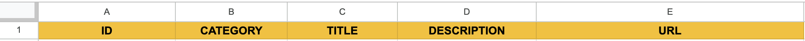
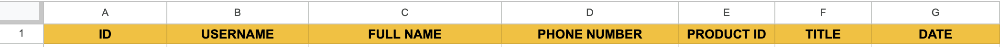
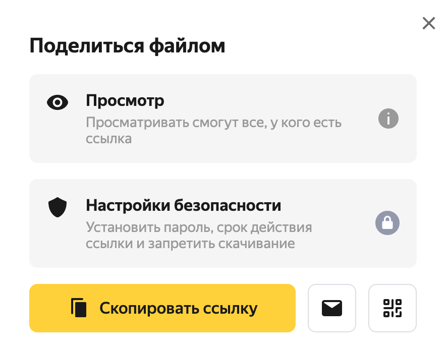

# Telegram shop-bot
## Изменить язык: [Русский](README.md)
***
Product catalog with manager notification and data transfer to / from Google spreadsheet.
## [DEMO](README.demo.md)
## Functionality:
1. Uploads a catalog from google sheets to the database with which the bot interacts
2. Based on the catalog, it generates a navigation menu
3. Allows the user to leave a request for the purchase of goods
4. Notifies the manager when leaving the application
## Commands:
**For convenience, it is recommended to add these commands to the side menu of the bot using [BotFather](https://t.me/BotFather).**
- menu - calls the menu (add via BotFather for convenient display)
- update - transfers changes from google spreadsheet to database (only available for manager)

## Installation and use:
- Install dependencies:
```sh
pip install -r requirements.txt
```
- in the .env file specify:\
   - Bot telegram token: **TELEBOT_TOKEN**=TOKEN\
   - Bot ID: **BOT_ID**=ID (first digits from bot token, before :)\
   - Manager ID: **MANAGER_ID**=MANAGER_ID; will have the right to execute the /update command, he will receive notifications - to receive notifications, the manager needs to activate the bot from his account (press the "start" button)
   > To determine the user ID, you need to send any message from the corresponding account to the next [bot] (https://t.me/getmyid_bot). The value contained in **Your user ID** - the user ID
   - Number of products displayed on each menu page (default 10, max 10): **PRODUCTS_AMOUNT**=10
   - Manager username - the "manager" button in the menu will enter the specified profile: **MANAGER_USERNAME**=example (specified without @)
- get file with credentials (connection parameters):\
https://console.cloud.google.com/ \
https://www.youtube.com/watch?v=bu5wXjz2KvU - instruction from 00:00 to 02:35\
Save the resulting file in the root of the project, with the name **service_account.json**
- provide service e-mail with access to the table (instruction in the video at the link above)
- set the appropriate names for the table and sheets in google sheets, the names of variables with the names of tables and sheets in the .env file are in brackets:\
Table name - **store** (SPREAD)\
The name of the sheet with the catalog (list of products) - **products** (PRODUCTS_SHEET)\
The name of the sheet with user orders is **users** (USERS_SHEET)
- run the project:
```sh
python3 main.py
```
## Recommendations for use:
- before activating the bot, be sure to set the names of the columns for easy navigation and correct operation:
     - the order of displayed information on the sheet with the catalog (list of goods):
         1. unique ID (article) of the product - can only contain numbers, should not be repeated
         2. category to which the product belongs (one of 7)
         3. product name
         4. product description
         5. link to Yandex disk with a photo of the product

     - the order of displayed information on the sheet with applications for mobile applications:
         1. unique user ID in telegram
         2. username of the user in telegram
         3. Name entered by the user
         4. user-entered phone number
         5. article of the selected product
         6. product name
         7. order time (in Moscow)

- the bot starts filling from the first empty line (the check is carried out on column A) - do not leave this column empty at the top of the table
- do not create additional columns, do not enter information that is not provided for in the terms of reference - may affect the correct operation
- a link to the photo of the product on the Yandex disk should be obtained through the "share file" menu, and not copied from the address bar

- in the description and name of the product it is recommended to avoid characters: "_", "#", "*" - for the markup to work correctly
- categories are determined by keywords (case insensitive) - the keywords indicated in brackets must be present in the column with the product category for its correct identification:
   - Outerwear, jackets (outerwear)
   - Dresses and skirts (dresses)
   - Tops / Blouses / Shirts and T-shirts (tops)
   - Pants and overalls, shorts (trousers)
   - Bags (bags)
   - Hats and accessories (accessories)
   - Shoes (shoes)
- before using the /update command, you should make sure that the changes made are saved in the Google spreadsheet - for this it is recommended to select an empty cell (hover over and click)