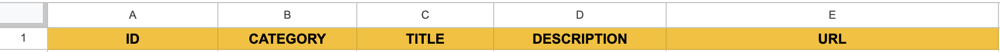
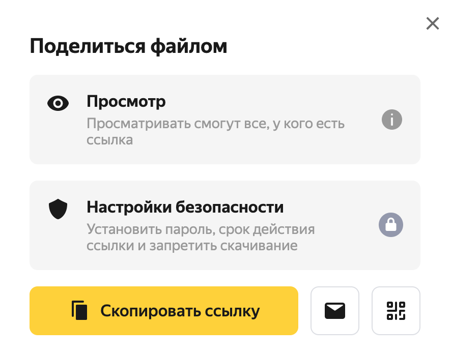

# Telegram shop-bot
## Change language: [English](README.en.md)
***
Каталог товаров с уведомлением менеджера и переносом данных из / в гугл таблицу.
## [DEMO](README.demo.md)
## Функционал:
1. Выгружает каталог из google таблиц в базу данных, с которой взаимодействует бот
2. На основании каталога формирует навигационное меню
3. Позволяет пользователю оставить заявку на приобретении товара
4. Уведомляет менеджера при оставлении заявки
## Команды:
**Для удобства рекомендуется добавить данные команды в боковое меню бота, используя [BotFather](https://t.me/BotFather).**
- menu - вызывает меню (добавить через BotFather для удобного отображения)
- update - переносит изменения из гугл таблицы в базу данных (доступна только для менеджера)

## Установка и использование:
- Установить зависимости:
```sh
pip install -r requirements.txt
```
- в файле .env указать:\
  - Токен телеграмм бота: **TELEBOT_TOKEN**=ТОКЕН\
  - ID бота: **BOT_ID**=ID (первые цифры из токена бота, до :)\
  - ID менеджера: **MANAGER_ID**=MANAGER_ID; будет иметь право на выполнение команды /update, ему будут приходить уведомления - для получения уведомлений менеджеру необходимо активировать бота со своего аккаунта (нажать кнопку "начать")
  > Для определения ID пользователя нужно отправить следующему [боту](https://t.me/getmyid_bot) любое сообщение с соответствующего аккаунта. Значение, содержащееся в **Your user ID** - ID пользователя
  - Количество товаров, отображаемых на каждой странице меню (по умолчанию 10, не более 10): **PRODUCTS_AMOUNT**=10
  - Username менеджера - на указанный профиль введет кнопка "менеджер" в меню: **MANAGER_USERNAME**=example (указывается без @)
- получить файл c credentials (параметрами для подключения):\
https://console.cloud.google.com/ \
https://www.youtube.com/watch?v=bu5wXjz2KvU - инструкция с 00:00 по 02:35\
Полученный файл сохранить в корне проекта, с именем **service_account.json**
- предоставить сервисному e-mail доступ к таблице (инструкция в видео по ссылке выше)
- задать соответствующие имена таблице и листам в google sheets, в скобках указаны имена переменных с именами таблиц и листов в файле .env:\
Имя таблицы - **store** (SPREAD)\
Имя листа с каталогом (списком товаров) - **products** (PRODUCTS_SHEET)\
Имя листа с заказами пользователей - **users** (USERS_SHEET)
- запустить проект:
```sh
python3 main.py
```
## Рекомендации по использованию:
- перед активацией бота обязательно задать имена столбцов для удобной навигации и корректной работы:
    - порядок выводимой информации на листе с каталогом (списком товаров):
        1. уникальный ID (артикул) товара - может содержать только числа, не должен повторяться 
        2. категория, к которой относится товар (одна из 7)
        3. название товара
        4. описание товара
        5. ссылка на яндекс диск с фотографией товара

    - порядок выводимой информации на листе с заявками на мобильные приложения:
        1. уникальный ID пользователя в telegram
        2. username пользователя в telegram
        3. введенные пользователем ФИО
        4. введенный пользователем номер телефона
        5. артикул выбранного товара
        6. название товара
        7. время заказа (по Москве)

- бот начинает заполнение с первой пустой строки (проверка ведется по столбцу A) - не оставлять это столбец пустым в верхней части таблицы
- не создавать дополнительные столбцы, не вносить информацию, не предусмотренную в техническом задании - может сказаться на корректности работы
- ссылка на фото товара на яндекс диске должна получаться через меню "поделиться файлом", а не копироваться из адресной строки

- в описании и названии товара рекомендуется избегать символов: "_", "#", "*" - для корректной работы разметки
- категории определяются по ключевым словам (без чувствительности к регистру) - указанные в скобка ключевые слова должны присутствовать в столбце с категорией товара для ее корректной идентификации:
  - Верхняя одежда, жакеты (верхняя одежда)
  - Платья и юбки (платья)
  - Топы / Блузы / Рубашки и футболки (топы)
  - Брюки и комбинезоны, шорты (брюки)
  - Сумки (сумки)
  - Головные уборы и аксессуары (аксессуары)
  - Обувь (обувь)
- перед применением команды /update следует убедиться, что внесенные изменения сохранились в гугл таблице - для этого рекомендуется выбрать пустую ячейку (навести курсор и нажать)
